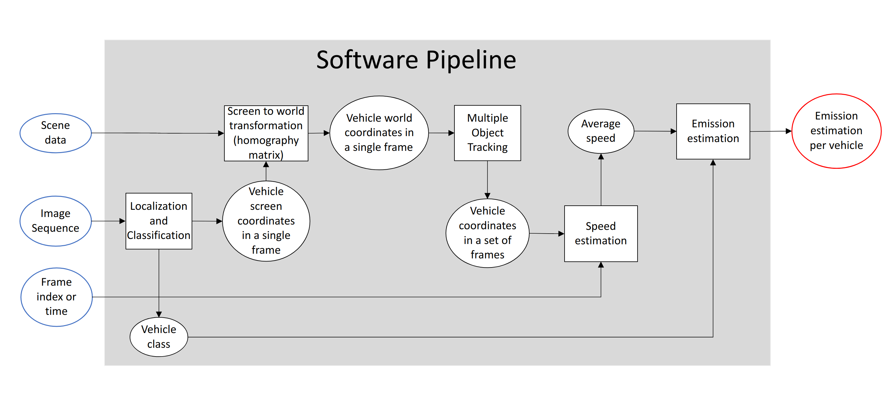
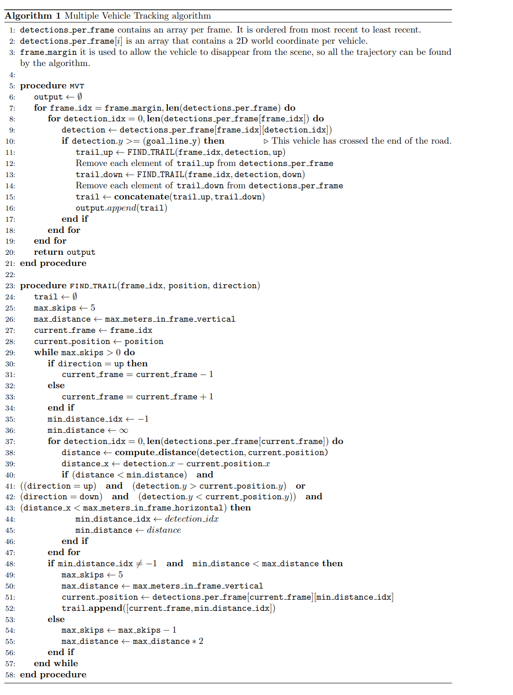

# Monitoring vehicle pollution and fuel consumption based on AI camera system and gas emission estimator model

<p align="center">
    
</p>

## Authors
 - Manuel Rodriguez Valido
 - Oscar Gomez-Cardenes
 - Eduardo Magdaleno

emails: {mrvalido,ogomezca,emagcas}@ull.edu.es

affiliation: Department of Industrial Engineering, University of La Laguna, San Cristóbal de La Laguna, Spain

## Citing this work
If using this work, please cite us.

Rodriguez Valido, M.; Gomez-Cardenes, O.; Magdaleno, E. Monitoring Vehicle Pollution and Fuel Consumption Based on AI Camera System and Gas Emission Estimator Model. Sensors 2023, 23, 312. https://doi.org/10.3390/s23010312

## Description
This code accompanies the paper "Monitoring vehicle pollution and fuel consumption based on AI camera system and gas emission estimator model".

Link to the paper: [https://www.mdpi.com/2035034](https://www.mdpi.com/2035034)

The software can be represented with the following diagram:
<p align="center">
    
</p>


## Localization
`yolov5` in its nano variant is used to localize and classify the vehicles in each frame. Weights and architecture are available through the [torch hub](https://pytorch.org/hub/ultralytics_yolov5/)
<p align="center">
    
</p>

## Screen to world transformation
By using -at least- 4 characterized points of the road plane, screen coordinates can be transformed into world coordinates by using a homography matrix:
<p align="center">
    
</p>

All the screen coordinates of the vehicles detected by the Localization module are transformed into world coordinates.

## Multiple Vehicle tracker
An algorithm that takes into account the position and time of the detected vehicles is used to group them into single trajectories:
<p align="center">
    
</p>

Once the trajectories of each vehicle are detected, their speed can be calculated, since we now have a set of positions and their relative time for each detected vehicle.

## Emissions estimation
We use the MOVESTAR estimation model, taken from [github](https://github.com/ziranw/MOVESTAR-Fuel-and-Emission-Model). The code has only minor modifications to speed up loading times of the csv data. For each detected vehicle we input its speed and vehicle class into the estimator.

## Setup

### Getting data
In order to run this project, you'll need some data. Currently, the code is fit to run sessions from the [BrnoCompSpeed dataset](https://github.com/JakubSochor/BrnoCompSpeed), which is available for research upon request. If using another dataset format, minor modifications must be done to the code.

The inputs needed to feed this system are:
1. A traffic camera video recording
2. Data that characterizes the geometry of the road

### Installing dependencies
In your python environment, install all the dependencies by running:
```shell
pip install -r requirements.txt
```

## Running the system

```shell
python main.py <path to your data directory>
```
or 
```shell
python main.py <path to your data directory> -i
```
for an interactive execution.

## License
See [license file](LICENSE)

## Acknowledgements
The authors would like to give special thanks to the authors of the
BrnoCompSpeed dataset and in particular to Jakub Špaňhel for making it available for the
development of this work.